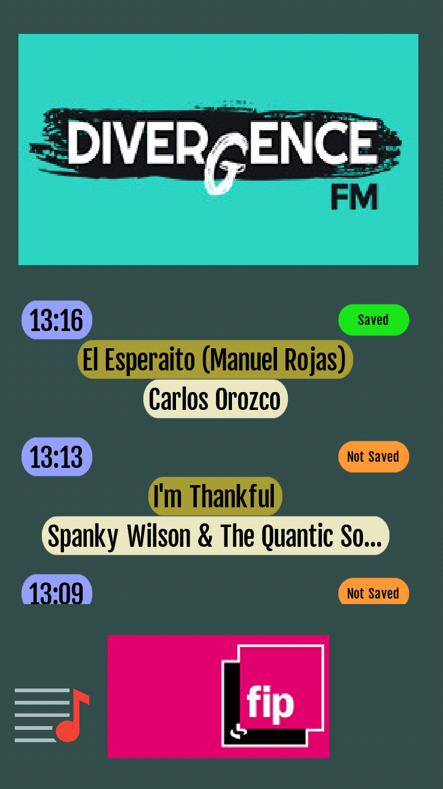
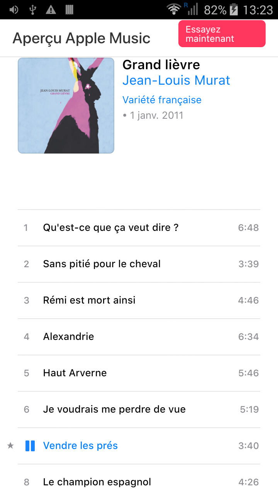

# Radio_track
Une application android pour obtenir / archiver les informations sur les titres entendus à la radio.

L'écran à l'ouverture de l'application :

Si le téléphone a un accès datas, en sélectionnant une station, l'application récupère la liste des derniers titres diffusés :

l'appui sur le bouton "not saved" enregistre localement les informations sur le titre :

l'appui sur le bouton "playlist" en bas à gauche ouvre la liste des pistes référencées :

Les pistes sont présentées par heure et par date. FIP propose des liens supplémentaires :

l'appui sur le bouton "youtube" ouvre le lien vers YouTube :

l'appui sur le bouton "play" ouvre le lien vers Itunes :

voici l'apk généré :
[Radio_track.apk](android-debug.apk)
