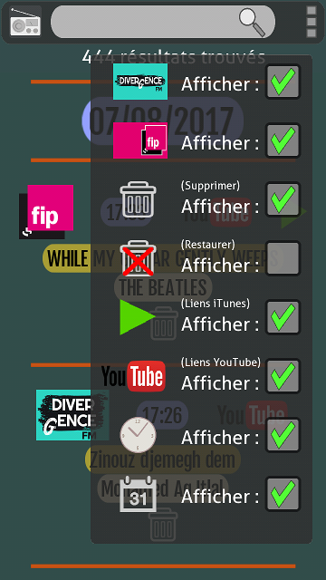
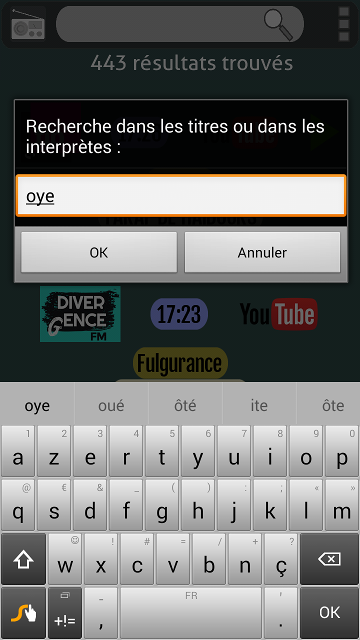

# Radio_track
Une application android pour obtenir / archiver les informations sur les titres entendus à la radio.

L'application a été testée et fonctionne à partir de la version 4.4 d'android (KitKat) et un affichage de 1280x720.

voici l'apk généré :
[Radio_track.apk](https://github.com/kaplone/Radio_track/raw/master/android-debug.apk)

L'écran à l'ouverture de l'application :

Si le téléphone a un accès datas, en sélectionnant une station, l'application récupère la liste des derniers titres diffusés :

l'appui sur le bouton "not saved" enregistre localement les informations sur le titre :

l'appui sur le bouton "playlist" en haut à gauche dans la barre ouvre la liste des pistes référencées (le bouton "radio" permet un retour vers la liste des radios) :

Les pistes sont présentées par heure et par date. L'appui sur le bouton "youtube" ouvre le lien vers YouTube. FIP propose parfois un lien supplémentaire vers Itunes :

l'appui sur le bouton "play" ouvre le lien vers Itunes :

l'appui sur les 3 carrés en haut à droite ouvre un menu d'options :
- DIVERGENCE FM affiche les résultats archivés de cette radio
- FIP affiche les résultats archivés de cette radio
- La corbeille affiche cette icone qui permet de supprimer une entrée de la liste
- La corbeille barrée affiche les résultats supprimés et cette icone qui permet de restaurer une entreé de la liste
- PLAY affiche cette icone, qui lance un éventuel lien vers Itunes
- YouTube affiche cette icone, qui lance le lien vers YouTube
- l'horloge affiche l'heure dans les résultats
- le calendrier affiche les dates dans les résultats

Une recherche textuelle est possible dans la liste :
 

voici l'apk généré :
[Radio_track.apk](https://github.com/kaplone/Radio_track/raw/master/android-debug.apk)
